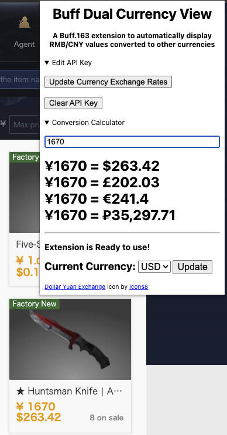

# RMBtoX / Buff Dual Currency View

## This repository is a Chrome & Edge extension for Buff.163.

Buff.163 is a popular European and Chinese marketplace for in game items for CSGO, TF2, DOTA, and more.
While Buff.163 can display various currencies without an extension, it can only display one at a time.
Additionally, all transactions are ultimately done using RMB/CNY, so most users do not change the
display currency anyway but would still like to know an items value in their fiat of choice. The included
conversion calculator can also be used as a general conversion calculator outside of Buff.163.

## To use the extension you need to generate a free API key from https://free.currencyconverterapi.com/.

This API provides exchange rates between CNY/RMB and other currencies,
such as USD, GBP, RUB, and EUR. All you need to do is verify your
email address to generate a free API key. Input the generated API key into the extensions popup window
to activate the extension, then select a currency to display
next to the RMB values.

**This is a FREE API and as such there is no uptime guarantee. Open an issue if the API is consistently down.**
 

### Without the extension Buff.163 looks like this:

### With the extension Buff.163 looks like this: 

