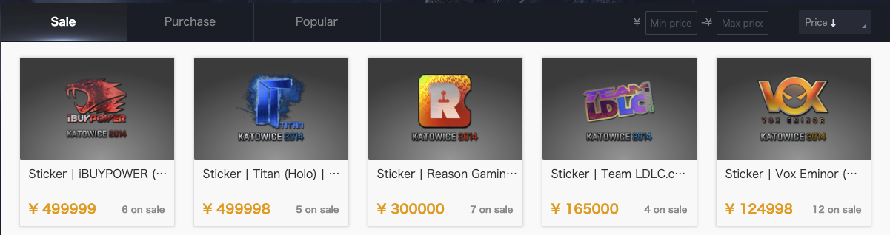
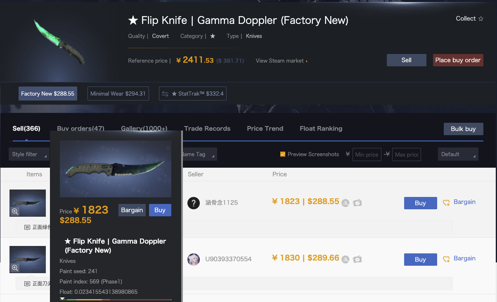

### RMBtoX

This repository is a Chrome & Edge extension for buff.163. Buff.163 is a popular marketplace for in game items for CSGO, TF2, DOTA, and more. This extension displays converted currencies next to an item's RMB value.

While buff.163 can display various currencies, all transactions are made in RMB and you need to modify your account settings each time to change the currency. Because of this it can be valuable to have two currencies displayed for each item.

Without the extension buff.163 looks like this:

With the extension buff.163 looks like this: 

To use the extension you need to generate a free API key from https://free.currencyconverterapi.com/. This API provides exchange rates between CNY/RMB and other currencies, such as USD, GBP, RUB, and EUR. All you need to do is verify your email address to generate a free API key. 

Input the generated API key into the extensions popup window to activate the extension, then select a currency to display next to the RMB values.